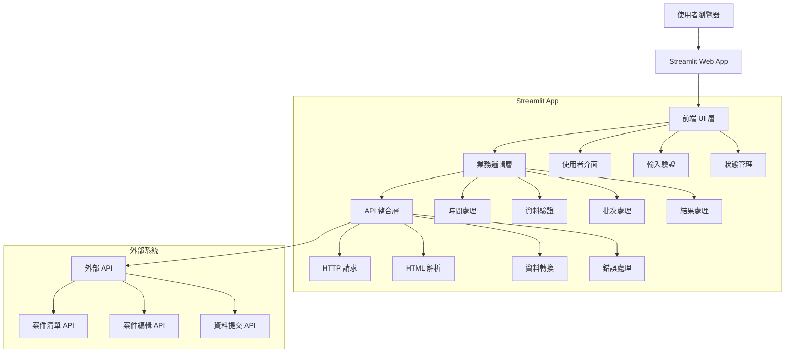
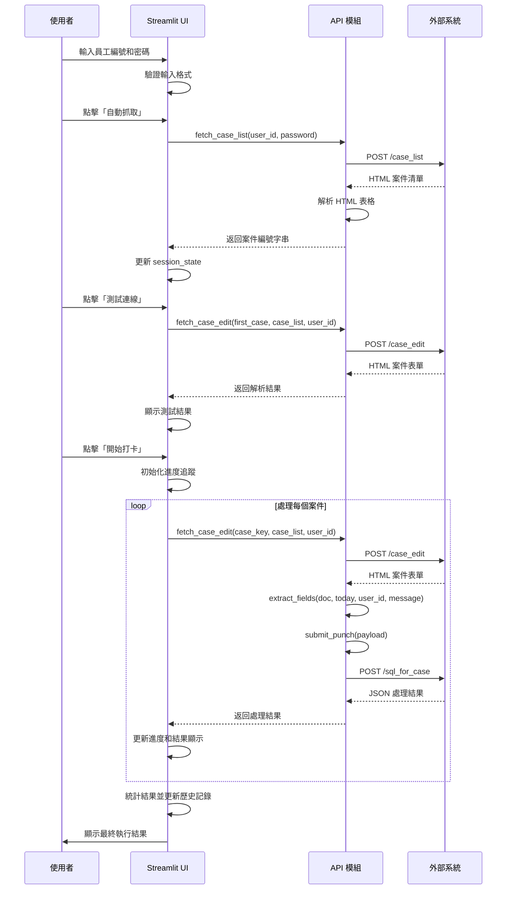

# 🏗️ 自動打卡系統 - 技術架構文件

## 📋 目錄

- [系統架構概覽](#系統架構概覽)
- [模組設計](#模組設計)
- [資料流程](#資料流程)
- [API 設計](#api-設計)
- [錯誤處理策略](#錯誤處理策略)
- [效能優化](#效能優化)
- [安全設計](#安全設計)
- [測試策略](#測試策略)

## 🎯 系統架構概覽

### 整體架構圖



### 技術堆疊

```yaml
前端:
  框架: Streamlit 1.28.0
  樣式: Custom CSS
  互動: JavaScript (內建)

後端邏輯:
  語言: Python 3.11+
  HTTP客戶端: requests 2.31.0
  HTML解析: BeautifulSoup4 4.12.2
  時間處理: datetime (內建)
  資料處理: json (內建)

外部整合:
  API平台: Netlify Functions
  協議: HTTP/HTTPS
  格式: HTML, JSON

部署:
  容器: Docker (可選)
  雲端: Streamlit Cloud, Heroku, Railway
  本地: Python + pip
```

## 🔧 模組設計

### 1. 前端 UI 模組

#### 檔案位置
- `streamlit_app.py` (行 9-43, 168-653)

#### 設計模式
- **MVC 模式**：Streamlit 作為 View，Python 函數作為 Controller
- **響應式設計**：使用 Streamlit 的 columns 和 containers
- **狀態管理**：使用 `st.session_state` 進行狀態持久化

#### 核心組件

```python
# 頁面配置
st.set_page_config(
    page_title="自動打卡系統",
    page_icon="🤖",
    layout="wide",
    initial_sidebar_state="collapsed"
)

# 自訂樣式
CUSTOM_CSS = """
<style>
    .success-box { /* 成功提示樣式 */ }
    .error-box { /* 錯誤提示樣式 */ }
    .info-box { /* 資訊提示樣式 */ }
</style>
"""

# 佈局設計
col1, col2 = st.columns([2, 1])  # 左側主要內容，右側操作區
```

#### 互動元件

```python
# 輸入組件
user_id = st.text_input("🆔 員工編號", key="user_id_input")
password = st.text_input("🔐 登入密碼", type="password", key="password_input")

# 操作按鈕
if st.button("🔄 自動抓取", disabled=not auto_fetch_enabled):
    # 執行自動抓取邏輯

# 進度顯示
progress_bar = st.progress(0)
status_placeholder = st.empty()
results_placeholder = st.empty()
```

### 2. 時間處理模組

#### 檔案位置
- `streamlit_app.py` (行 43-56)

#### 設計原則
- **時區安全**：統一使用台灣時區 (UTC+8)
- **格式一致**：提供統一的時間格式化函數
- **可測試性**：純函數設計，方便單元測試

#### 核心實作

```python
# 台灣時區定義
TAIWAN_TZ = timezone(timedelta(hours=8))

def get_taiwan_time():
    """取得台灣當前時間"""
    return datetime.now(TAIWAN_TZ)

def get_taiwan_date_string():
    """取得台灣當前日期字串 (YYYY-MM-DD)"""
    return get_taiwan_time().strftime("%Y-%m-%d")

def get_taiwan_datetime_string():
    """取得台灣當前日期時間字串 (YYYY-MM-DD HH:MM:SS)"""
    return get_taiwan_time().strftime("%Y-%m-%d %H:%M:%S")
```

#### 使用場景
- 工作日誌時間戳記
- 執行歷史記錄
- 檔案匯出命名

### 3. API 整合模組

#### 檔案位置
- `streamlit_app.py` (行 59-162)

#### 設計模式
- **工廠模式**：統一的 HTTP 請求處理
- **策略模式**：不同 API 端點的處理策略
- **快取模式**：使用 `@st.cache_data` 減少重複請求

#### 核心函數架構

```python
# 基礎配置
BASE_URL = "https://herbworklog.netlify.app/.netlify/functions"

@st.cache_data(ttl=300)  # 5分鐘快取
def fetch_case_list(user_id, password):
    """
    自動抓取案件清單
    
    Args:
        user_id (str): 員工編號
        password (str): 登入密碼
    
    Returns:
        str: 逗號分隔的案件編號字串，失敗時返回 None
    """
    try:
        # 1. 構建請求資料
        data = {
            "user_id": user_id,
            "f_password": password,
            "f_password2": "",
            "from_case_edit": ""
        }
        
        # 2. 發送 HTTP 請求
        resp = requests.post(f"{BASE_URL}/case_list", data=data, timeout=30)
        resp.raise_for_status()
        
        # 3. 解析 HTML 回應
        soup = BeautifulSoup(resp.text, "html.parser")
        table = soup.find("table", {"id": "caselist1"})
        
        # 4. 提取案件編號
        case_numbers = []
        if table:
            rows = table.find("tbody").find_all("tr") if table.find("tbody") else table.find_all("tr")
            for row in rows:
                tds = row.find_all("td")
                if len(tds) >= 2:
                    case_number = tds[1].get_text(strip=True)
                    if case_number:
                        case_numbers.append(case_number)
        
        # 5. 返回結果
        return ",".join(case_numbers) if case_numbers else None
        
    except Exception as e:
        # 錯誤處理：記錄但不拋出異常
        return None
```

#### HTML 解析策略

```python
def extract_fields(doc, today, user_id, punch_message):
    """
    從 HTML 文件提取表單欄位
    
    策略：
    1. 定義欄位 ID 清單
    2. 遍歷所有欄位
    3. 根據元素類型提取值
    4. 處理特殊欄位 (f_key, f_log)
    """
    field_ids = [
        "f_key", "f_case_name", "f_person_id", "f_person2_id",
        "f_event_date", "f_alert_date", "f_log", "f_note",
        "f_to_do", "f_dir", "f_risk", "f_doc"
    ]
    
    payload = {}
    for fid in field_ids:
        el = doc.find(id=fid)
        if not el:
            payload[fid] = ""
        elif el.name == "input":
            payload[fid] = el.get("value", "").strip()
        elif el.name == "textarea":
            payload[fid] = el.text.strip()
        else:
            payload[fid] = ""
    
    # 特殊處理
    payload["f_key"] = int(payload["f_key"])  # 轉換為整數
    
    # 更新工作日誌（在原有內容前加入新的打卡記錄）
    original_log = payload.get("f_log", "")
    payload["f_log"] = f"{today}\n{punch_message}\n\n{original_log}".strip()
    
    # 設定更新資訊
    payload["f_update_date"] = today
    payload["f_last_editor"] = user_id
    
    return payload
```

### 4. 批次處理模組

#### 設計原則
- **錯誤隔離**：單一案件失敗不影響其他案件
- **進度追蹤**：即時更新處理進度
- **結果聚合**：統一收集和展示處理結果

#### 核心流程

```python
def batch_process_cases(case_keys, user_id, case_list, punch_message):
    """
    批次處理案件打卡
    
    流程：
    1. 初始化進度追蹤
    2. 遍歷每個案件
    3. 錯誤隔離處理
    4. 聚合結果
    5. 更新進度顯示
    """
    results = []
    today = get_taiwan_date_string()
    
    for i, key in enumerate(case_keys):
        # 更新進度
        progress = (i + 1) / len(case_keys)
        progress_bar.progress(progress)
        
        try:
            # 處理單一案件
            result = process_single_case(key, case_list, user_id, punch_message, today)
            results.append(result)
            
            # 即時顯示結果
            update_result_display(results)
            
            # 控制請求頻率
            time.sleep(1)
            
        except Exception as e:
            # 錯誤處理：記錄但繼續處理其他案件
            error_result = create_error_result(key, str(e))
            results.append(error_result)
    
    return results
```

### 5. 狀態管理模組

#### Session State 架構

```python
# 初始化狀態
if 'punch_log' not in st.session_state:
    st.session_state.punch_log = []

if 'auto_case_list' not in st.session_state:
    st.session_state.auto_case_list = ""

# 狀態更新模式
def update_execution_log(results, success_count, total_count):
    """更新執行歷史"""
    log_entry = {
        "timestamp": get_taiwan_datetime_string(),
        "results": results,
        "success_count": success_count,
        "total_count": total_count,
        "mode": "正常模式"
    }
    st.session_state.punch_log.append(log_entry)

# 狀態清理
def clear_session_state():
    """清除敏感狀態資料"""
    if 'auto_case_list' in st.session_state:
        del st.session_state.auto_case_list
```

## 📊 資料流程

### 完整執行流程圖



### 資料轉換流程

```python
# 1. 使用者輸入 → 驗證資料
user_input = {
    "user_id": "1889",
    "password": "secret",
    "punch_message": "自動打卡成功"
}

# 2. API 請求 → HTML 回應
html_response = """
<table id="caselist1">
    <tr><td>序號</td><td>00020</td><td>案件名稱A</td></tr>
    <tr><td>序號</td><td>00021</td><td>案件名稱B</td></tr>
</table>
"""

# 3. HTML 解析 → 結構化資料
parsed_cases = ["00020", "00021"]
case_list_string = "00020,00021"

# 4. 案件資料 → 表單欄位
case_form_data = {
    "f_key": 123,
    "f_case_name": "案件名稱A",
    "f_log": "2024-12-19\n自動打卡成功\n\n原有日誌內容",
    "f_update_date": "2024-12-19",
    "f_last_editor": "1889"
}

# 5. 表單資料 → JSON 提交
json_payload = {
    "fields": json.dumps(case_form_data)
}

# 6. API 回應 → 結果統計
execution_result = {
    "case": "00020",
    "status": "✅ 成功",
    "message": "案件：案件名稱A",
    "details": "f_key: 123，已更新工作日誌"
}
```

## 🔌 API 設計

### 外部 API 規格

#### 1. 案件清單 API

```http
POST /.netlify/functions/case_list
Content-Type: application/x-www-form-urlencoded

user_id=1889&f_password=secret&f_password2=&from_case_edit=
```

**預期回應格式**：
```html
<table id="caselist1">
    <tbody>
        <tr>
            <td>1</td>
            <td>00020</td>
            <td>案件名稱A</td>
            <td>其他資訊</td>
        </tr>
        <tr>
            <td>2</td>
            <td>00021</td>
            <td>案件名稱B</td>
            <td>其他資訊</td>
        </tr>
    </tbody>
</table>
```

#### 2. 案件編輯 API

```http
POST /.netlify/functions/case_edit
Content-Type: application/x-www-form-urlencoded

form_key=00020&table_case_id_list=00020,00021&user_id=1889
```

**預期回應格式**：
```html
<form>
    <input id="f_key" value="123" />
    <input id="f_case_name" value="案件名稱A" />
    <textarea id="f_log">現有工作日誌內容</textarea>
    <!-- 其他表單欄位 -->
</form>
```

#### 3. 資料提交 API

```http
POST /.netlify/functions/sql_for_case
Content-Type: application/x-www-form-urlencoded

fields={"f_key":123,"f_case_name":"案件名稱A","f_log":"更新後的日誌"}
```

**預期回應格式**：
```json
{
    "status": "success",
    "message": "更新成功"
}
```

### 內部 API 設計

#### 錯誤處理模式

```python
class APIError(Exception):
    """API 相關錯誤的基礎類別"""
    pass

class ConnectionError(APIError):
    """連線錯誤"""
    pass

class AuthenticationError(APIError):
    """身份驗證錯誤"""
    pass

class DataFormatError(APIError):
    """資料格式錯誤"""
    pass

def safe_api_call(func, *args, **kwargs):
    """安全的 API 呼叫包裝器"""
    try:
        return func(*args, **kwargs)
    except requests.ConnectionError:
        raise ConnectionError("無法連接到伺服器")
    except requests.Timeout:
        raise ConnectionError("請求逾時")
    except requests.HTTPError as e:
        if e.response.status_code == 401:
            raise AuthenticationError("身份驗證失敗")
        else:
            raise APIError(f"HTTP 錯誤：{e.response.status_code}")
    except Exception as e:
        raise APIError(f"未知錯誤：{str(e)}")
```

## 🛡️ 錯誤處理策略

### 分層錯誤處理

```python
# 第1層：輸入驗證
def validate_user_input(user_id, password, case_list):
    """驗證使用者輸入"""
    errors = []
    
    if not user_id or not user_id.strip():
        errors.append("員工編號不能為空")
    
    if not password or len(password) < 4:
        errors.append("密碼長度至少需要4個字元")
    
    if not case_list or not case_list.strip():
        errors.append("案件清單不能為空")
    
    if errors:
        raise ValidationError("輸入驗證失敗", errors)

# 第2層：業務邏輯錯誤
def process_case_with_retry(case_key, max_retries=3):
    """帶重試機制的案件處理"""
    for attempt in range(max_retries):
        try:
            return process_single_case(case_key)
        except TemporaryError as e:
            if attempt == max_retries - 1:
                raise PermanentError(f"重試 {max_retries} 次後仍然失敗")
            time.sleep(2 ** attempt)  # 指數退避
        except PermanentError:
            raise  # 永久錯誤不重試

# 第3層：UI 錯誤展示
def display_error(error, error_type="error"):
    """統一的錯誤顯示"""
    if error_type == "warning":
        st.warning(f"⚠️ {error}")
    elif error_type == "info":
        st.info(f"ℹ️ {error}")
    else:
        st.error(f"❌ {error}")
```

### 錯誤恢復機制

```python
def resilient_batch_process(case_keys):
    """具備錯誤恢復能力的批次處理"""
    results = []
    failed_cases = []
    
    # 第一輪處理
    for case_key in case_keys:
        try:
            result = process_single_case(case_key)
            results.append(result)
        except Exception as e:
            failed_cases.append(case_key)
            results.append(create_error_result(case_key, str(e)))
    
    # 第二輪重試失敗案件
    if failed_cases and st.button("🔄 重試失敗案件"):
        retry_results = []
        for case_key in failed_cases:
            try:
                result = process_single_case(case_key)
                retry_results.append(result)
                # 更新原始結果
                update_result_in_list(results, case_key, result)
            except Exception as e:
                retry_results.append(create_error_result(case_key, str(e)))
        
        st.info(f"重試完成，成功 {len([r for r in retry_results if r['status'].startswith('✅')])} 筆")
    
    return results
```

## ⚡ 效能優化

### 快取策略

```python
# 1. API 回應快取
@st.cache_data(ttl=300)  # 5分鐘快取
def fetch_case_list(user_id, password):
    """快取案件清單，避免重複請求"""
    pass

@st.cache_data(ttl=60)   # 1分鐘快取
def fetch_case_edit(case_key, case_list, user_id):
    """快取案件編輯頁面，減少伺服器負載"""
    pass

# 2. 計算結果快取
@st.cache_data
def calculate_success_rate(results):
    """快取成功率計算結果"""
    success_count = sum(1 for r in results if r["status"].startswith("✅"))
    return success_count / len(results) * 100 if results else 0

# 3. 狀態快取
def get_cached_case_list():
    """從 Session State 取得快取的案件清單"""
    return st.session_state.get('auto_case_list', '')
```

### 並行處理優化

```python
import concurrent.futures
import threading

def parallel_case_processing(case_keys, max_workers=3):
    """並行處理案件（謹慎使用，避免 API 限流）"""
    results = []
    progress_lock = threading.Lock()
    
    def process_with_progress(case_key, index):
        try:
            result = process_single_case(case_key)
            with progress_lock:
                progress_bar.progress((index + 1) / len(case_keys))
            return result
        except Exception as e:
            return create_error_result(case_key, str(e))
    
    # 注意：實際部署時需要考慮 API 限流
    with concurrent.futures.ThreadPoolExecutor(max_workers=max_workers) as executor:
        future_to_case = {
            executor.submit(process_with_progress, case_key, i): case_key 
            for i, case_key in enumerate(case_keys)
        }
        
        for future in concurrent.futures.as_completed(future_to_case):
            result = future.result()
            results.append(result)
    
    return results
```

### 記憶體優化

```python
def optimize_session_state():
    """優化 Session State 記憶體使用"""
    # 限制歷史記錄數量
    MAX_LOG_ENTRIES = 100
    if len(st.session_state.punch_log) > MAX_LOG_ENTRIES:
        st.session_state.punch_log = st.session_state.punch_log[-MAX_LOG_ENTRIES:]
    
    # 清理過期快取
    clear_expired_cache()

def clear_expired_cache():
    """清理過期的快取資料"""
    # Streamlit 會自動處理 @st.cache_data 的過期
    # 這裡處理自定義快取
    pass
```

## 🔒 安全設計

### 輸入安全化

```python
import html
import re

def sanitize_input(user_input, input_type="text"):
    """輸入資料安全化"""
    if not isinstance(user_input, str):
        user_input = str(user_input)
    
    # HTML 轉義
    user_input = html.escape(user_input)
    
    # 根據類型進行額外驗證
    if input_type == "user_id":
        # 員工編號只允許數字和字母
        if not re.match(r'^[a-zA-Z0-9]+$', user_input):
            raise ValueError("員工編號格式不正確")
    
    elif input_type == "case_list":
        # 案件清單只允許數字和逗號
        if not re.match(r'^[0-9,]+$', user_input.replace(' ', '')):
            raise ValueError("案件清單格式不正確")
    
    return user_input.strip()

def validate_session_security():
    """驗證 Session 安全性"""
    # 檢查 Session 是否過期
    if 'session_start' in st.session_state:
        session_duration = datetime.now() - st.session_state.session_start
        if session_duration.total_seconds() > 3600:  # 1小時過期
            st.session_state.clear()
            st.error("Session 已過期，請重新登入")
            st.stop()
```

### 敏感資料保護

```python
def protect_sensitive_data():
    """保護敏感資料"""
    # 不在 Session State 中儲存密碼
    sensitive_keys = ['password', 'f_password']
    for key in sensitive_keys:
        if key in st.session_state:
            del st.session_state[key]
    
    # 清理 URL 參數中的敏感資訊
    query_params = st.experimental_get_query_params()
    for param in sensitive_keys:
        if param in query_params:
            del query_params[param]
            st.experimental_set_query_params(**query_params)

def mask_sensitive_info(text, pattern=r'\d{4,}'):
    """遮罩敏感資訊"""
    return re.sub(pattern, lambda m: m.group(0)[:2] + '*' * (len(m.group(0)) - 4) + m.group(0)[-2:], text)
```

## 🧪 測試策略

### 單元測試架構

```python
import unittest
from unittest.mock import patch, MagicMock

class TestTimeModule(unittest.TestCase):
    """時間模組測試"""
    
    def test_get_taiwan_time(self):
        """測試台灣時間取得"""
        taiwan_time = get_taiwan_time()
        self.assertEqual(taiwan_time.tzinfo.utcoffset(None).total_seconds(), 8*3600)
    
    def test_date_string_format(self):
        """測試日期字串格式"""
        date_string = get_taiwan_date_string()
        self.assertRegex(date_string, r'^\d{4}-\d{2}-\d{2}$')

class TestAPIModule(unittest.TestCase):
    """API 模組測試"""
    
    @patch('requests.post')
    def test_fetch_case_list_success(self, mock_post):
        """測試案件清單抓取成功情境"""
        # 模擬成功回應
        mock_response = MagicMock()
        mock_response.text = """
        <table id="caselist1">
            <tr><td>1</td><td>00020</td></tr>
            <tr><td>2</td><td>00021</td></tr>
        </table>
        """
        mock_post.return_value = mock_response
        
        result = fetch_case_list("1889", "password")
        self.assertEqual(result, "00020,00021")
    
    @patch('requests.post')
    def test_fetch_case_list_failure(self, mock_post):
        """測試案件清單抓取失敗情境"""
        mock_post.side_effect = requests.ConnectionError()
        
        result = fetch_case_list("1889", "password")
        self.assertIsNone(result)

class TestDataProcessing(unittest.TestCase):
    """資料處理測試"""
    
    def test_extract_fields(self):
        """測試欄位提取"""
        html_content = """
        <input id="f_key" value="123" />
        <input id="f_case_name" value="測試案件" />
        <textarea id="f_log">原有日誌</textarea>
        """
        doc = BeautifulSoup(html_content, "html.parser")
        
        result = extract_fields(doc, "2024-12-19", "1889", "測試訊息")
        
        self.assertEqual(result["f_key"], 123)
        self.assertEqual(result["f_case_name"], "測試案件")
        self.assertIn("測試訊息", result["f_log"])
        self.assertIn("原有日誌", result["f_log"])
```

### 整合測試

```python
class TestIntegration(unittest.TestCase):
    """整合測試"""
    
    def setUp(self):
        """測試前置作業"""
        self.test_user_id = "test_user"
        self.test_password = "test_pass"
        self.test_case_list = "00020,00021"
    
    @patch('streamlit_app.fetch_case_list')
    @patch('streamlit_app.fetch_case_edit')
    @patch('streamlit_app.submit_punch')
    def test_complete_punch_flow(self, mock_submit, mock_fetch_edit, mock_fetch_list):
        """測試完整打卡流程"""
        # 設定模擬回應
        mock_fetch_list.return_value = self.test_case_list
        mock_fetch_edit.return_value = self.create_mock_doc()
        mock_submit.return_value = "success"
        
        # 執行完整流程
        results = execute_complete_punch_flow(
            self.test_user_id,
            self.test_password,
            "測試打卡"
        )
        
        # 驗證結果
        self.assertEqual(len(results), 2)
        self.assertTrue(all(r["status"].startswith("✅") for r in results))
    
    def create_mock_doc(self):
        """建立模擬的 HTML 文件"""
        html = """
        <input id="f_key" value="123" />
        <input id="f_case_name" value="測試案件" />
        <textarea id="f_log">測試日誌</textarea>
        """
        return BeautifulSoup(html, "html.parser")
```

### 效能測試

```python
import time
import cProfile

def performance_test():
    """效能測試"""
    
    def test_batch_processing():
        """測試批次處理效能"""
        start_time = time.time()
        
        # 模擬處理 100 個案件
        mock_cases = [f"case_{i:03d}" for i in range(100)]
        results = []
        
        for case in mock_cases:
            # 模擬處理時間
            time.sleep(0.01)
            results.append({"case": case, "status": "success"})
        
        end_time = time.time()
        
        print(f"處理 100 個案件耗時：{end_time - start_time:.2f} 秒")
        print(f"平均每案件：{(end_time - start_time) / 100 * 1000:.2f} 毫秒")
    
    # 執行效能分析
    cProfile.run('test_batch_processing()')

def memory_test():
    """記憶體使用測試"""
    import psutil
    import os
    
    process = psutil.Process(os.getpid())
    
    before_memory = process.memory_info().rss / 1024 / 1024  # MB
    
    # 執行記憶體密集操作
    large_data = []
    for i in range(10000):
        large_data.append({
            "timestamp": get_taiwan_datetime_string(),
            "results": [{"case": f"case_{j}", "status": "success"} for j in range(10)],
            "success_count": 10,
            "total_count": 10
        })
    
    after_memory = process.memory_info().rss / 1024 / 1024  # MB
    
    print(f"記憶體使用：{before_memory:.2f} MB → {after_memory:.2f} MB")
    print(f"增加：{after_memory - before_memory:.2f} MB")
    
    # 清理
    del large_data
```

---

📝 **文件版本**：1.0  
📅 **最後更新**：2024年12月  
👨‍💻 **維護者**：系統開發團隊 